# SKN16-1st-3Team
SKN 16기 1차 단위프로젝트

 

# ⚡ 프로젝트 소개

## 📎 프로젝트명  
**지역별 전기차 수용성 평가 시스템**  
_전기차 등록 대수와 충전소 수 간의 상관관계 분석_

---

## 📆 기간  
2025년 7월 3일(목) ~ 7월 4일(금)

---

## 🎯 목적  
- 전기차 확산에 따라 증가하는 충전 인프라 수요를 데이터로 분석하고,  
  **지역별 전기차 수용 능력을 객관적으로 평가**하기 위한 시스템 구축  
- 데이터 분석과 프로그래밍 기초 역량 향상

---

## 🔍 수집 데이터
- 차지인포: 전국 전기차 등록 현황  
- 공공데이터포털: 충전소 현황  
- 기아,현대,제네시스 자동차 고객 FAQ

### 📎 연도별 누적 충전기 구축 현황
  
 
 
### 📎 연도별 누적 전기차 수 등록 현황
 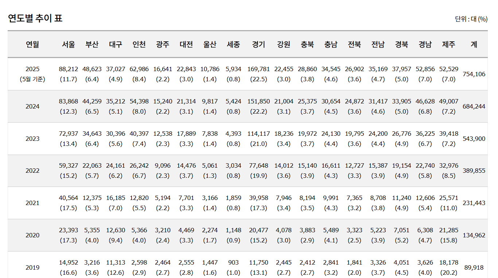 

---
## erd
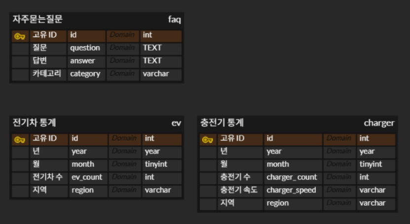 

---

## 🔍 주요 기능 및 구현 내용

### 🚗 1. 전기차 등록 대수 vs 충전소 수 분석
- 전국 지역별 전기차 등록 대수와 충전소 수를 비교하여 **상관관계 분석**
- **차량 1대당 충전소 수 비율 계산** → `Ev_per_station_ratio` 지표 도출
- 이를 기반으로 **지역별 충전 인프라 부족 여부 시각화**

---

### 📊 2. 시각화 요소

- **연도별 지역별 분포 파이 그래프**:  
  - 연도별로 **지역 간 전기차 등록량 비율**, **충전소 비율**을 파이 차트로 시각화  
  - 각 시점에서 **어느 지역이 가장 많은 비중을 차지하고 있는지** 직관적으로 파악 가능  
- **지역별 전기차 수 & 충전소 수**: 이중 막대 그래프
- **지도 기반 시각화**: Choropleth Map (지역별 수용성 색상 구분)
- **차량당 충전소 비율**: 수평 막대 그래프 _(막대가 짧을수록 충전 인프라 여유 있음)_  
- **연도별 증가 추이 비교**: 전기차 vs 충전소 선 그래프  

---

## 💡 기술적 시도 및 개선점

### 🔸 Heatmap 한계 극복
- 데이터 지역 수가 적어 정확한 분포 표현이 어려웠기 때문에  
  **Choropleth Map**으로 전환하여 더 명확한 지역 구분 시각화 구현

### 🔸 GeoJSON 파일 로딩 최적화
- GeoJSON 지도 파일 용량이 커서 로딩이 느렸으나,  
  **필요 지역만 추출하여 경량화** 처리로 성능 개선

### 🔸 Streamlit 통합 충돌 해결
- 팀원별로 서로 다른 파일 이름으로 시각화를 개발하여  
  통합 시 오류 발생 → **모든 파일을 모듈화하고 `app.py`에서 일괄 호출하는 구조로 통일**

---

## ✅ 기대 효과
- 단순한 EV/충전소 수 비교를 넘어,  
  **지역별 전기차 수용 능력을 정량적으로 평가할 수 있는 지표 제공**
- **공공데이터 기반의 교통/환경 정책 수립**에 참고 가능한 시각화 자료 생성
- **Streamlit 대시보드 구현**을 통해 사용자가 직관적으로 정보를 탐색할 수 있도록 구성

---

# 🫂 팀 소개
 
<table>
  <tr>
    <td align="center">
       
      <b>강현진</b> 
      팀장
    </td>
    <td align="center">
       
      <b>김나은</b> 
      Crawling
    </td>
    <td align="center">
       
      <b>허원준</b> 
      MySQL
    </td>
  </tr>
  <tr>
    <td align="center">
       
      <b>양금희</b> 
      ERD
    </td>
    <td align="center">
       
      <b>차하경</b> 
      Streamlit
    </td>
    <td></td> <!-- 빈칸 -->
  </tr>
</table>

# 🛠 기술 스택
 
<table>
  <tr>
    <td align="center">
       Git
    </td>
    <td align="center">
       GitHub
    </td>
    <td align="center">
       Python
    </td>
    <td align="center">
       Streamlit
    </td>
    <td align="center">
       MySQL
    </td>
  </tr>
</table>

# 📄 화면 설계서
 

# 🔍 수집 데이터
  

# 💻 실제 화면
 

### 📍 1. 지역별 전기차 등록 현황 시각화

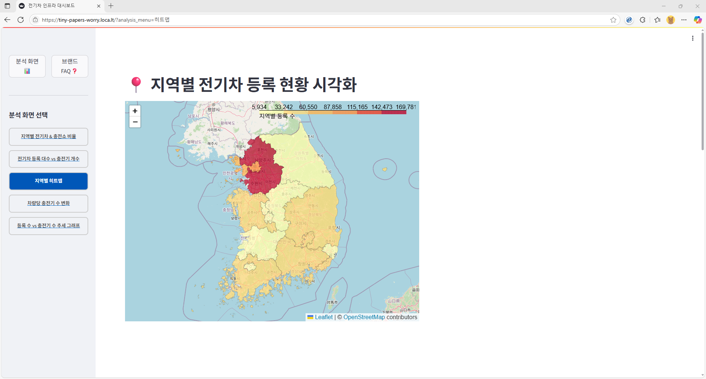
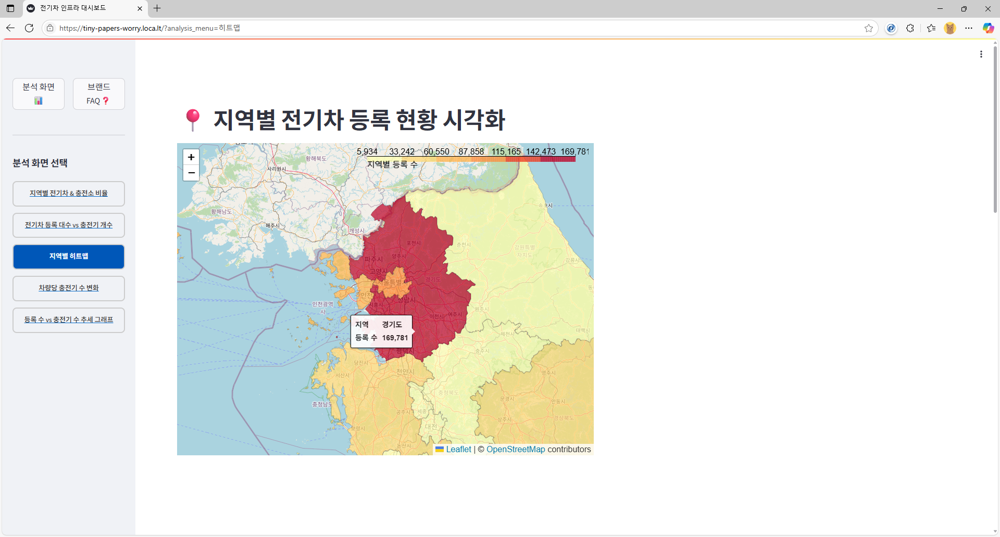

---

### 📍 2. 지역별 전기차 & 충전소 비율 (파이차트)

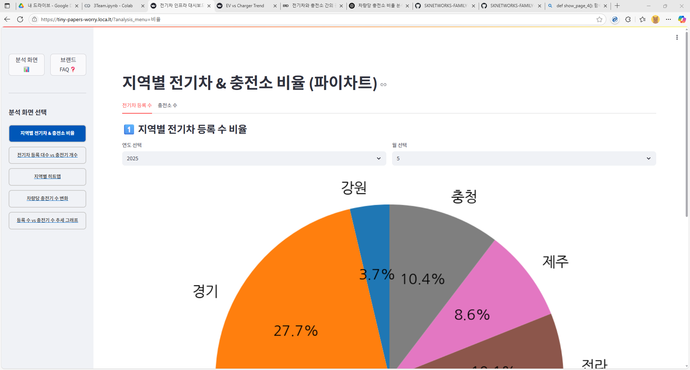
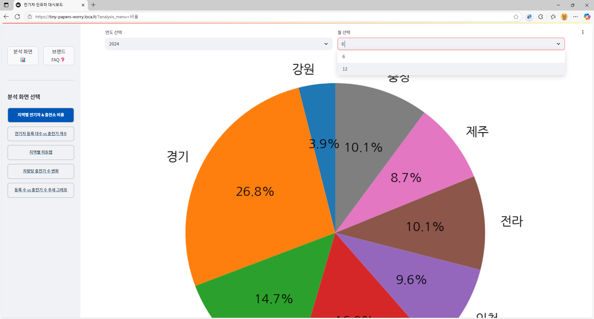

---

### 📍 3. 지역별 차량당 충전기 수

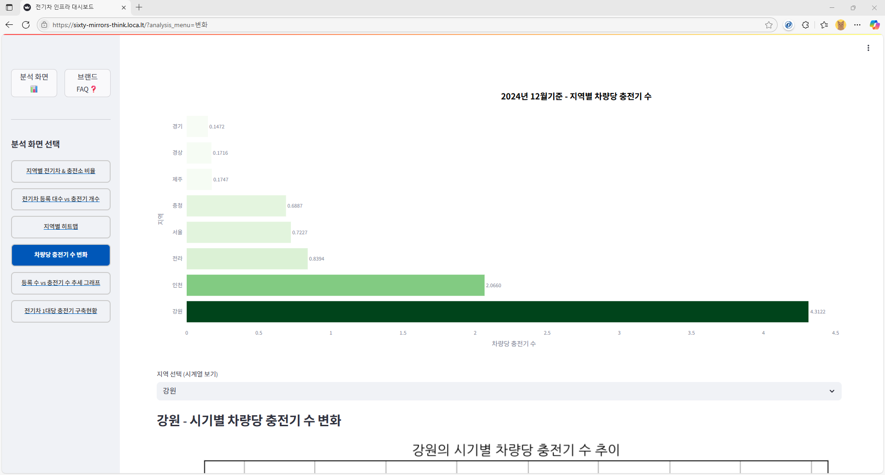
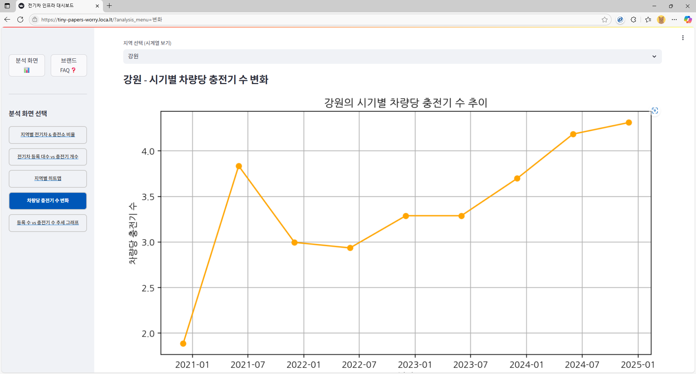

1)차트 :2024년 12월 기준 - 지역별 차량당 충전기수

2024년 12월 시점의 그래프는  누적된 충전기 수 / 차량 수 비율 을 통해 어떤 지역이 충전 인프라에 더 투자했는지를 간접적으로 보여줍니다.

2)차트 : 지역 - 시기별 차량당 충전기 수 변화
지역을 선택하여, 시기별 차량당 충전기 수 변화를 볼 수 있습니다

---

### 📍 4. 지역별 전기차 등록 대수 및 충전기 개수 비교

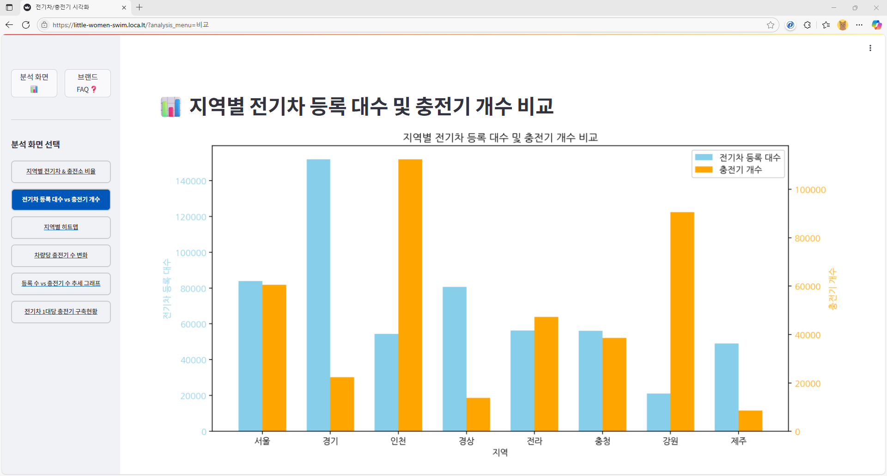

---

### 📍 5. 연도별 전기차 vs 충전소 증가 추이 (선 그래프)

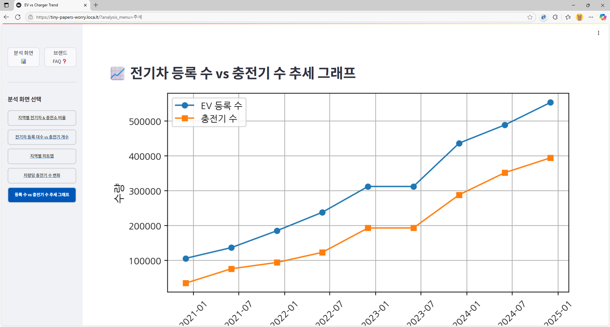

---

### 📍 6. 전기차 제조사 고객 FAQ 분석

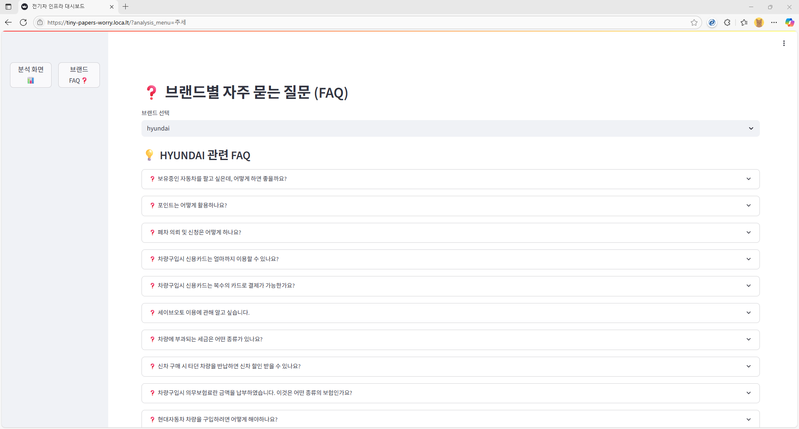
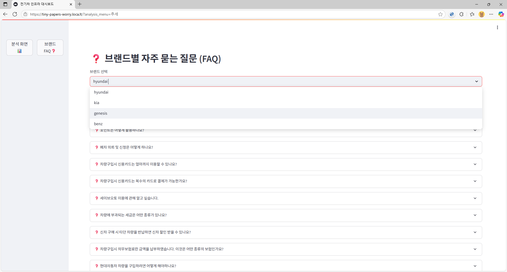
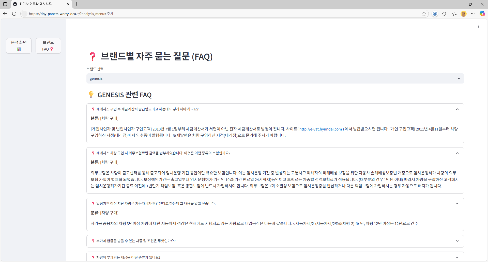

# 🖊 개발 과정에서 발생한 이슈 및 해결 방법
  **Streamlit 통합 과정의 충돌 및 구조 정리 문제**
  각 팀원이 Streamlit을 활용하여 개별적으로 시각화 화면을 구현했지만, 이를 하나의 앱으로 통합하는 과정에서 파일 이름의 불일치, merge 충돌 등의 문제가 반복적으로 발생했습니다. 각자가 작성한 파일명이 제각각이어서 실행 시 로딩 오류가 발생하거나, 기능별 구조가 중복되는 일이 잦았습니다. 이를 해결하기 위해 팀원 간 약속을 통해 모든 메인 파일명을 app.py로 통일하고, 개별 기능을 모듈 형태로 디렉토리에 정리한 뒤, 메인 파일에서 분기 호출할 수 있도록 통합 구조를 재설계하였습니다. 이 방식은 통합의 일관성을 높이고, 유지보수에도 용이한 구조로 이어졌습니다. 

 **Scatter Plot 시각화 한계 및 파이 그래프로의 전환**
  초기에는 충전소 수와 전기차 등록 수 간의 관계를 시각화하기 위해 **산점도(Scatter Plot)**를 활용하였습니다. 하지만 실제로 분석 가능한 지역 개수가 많지 않아, 점의 수가 너무 적고 밀도도 낮아 시각적 의미 전달력이 떨어지는 문제가 있었습니다. 이에 따라 시각화 방식을 **지역별 비율 중심의 파이 차트(Pie Chart)**로 전환하였고, 전기차 등록 수와 충전소 수를 각각 연도별, 지역별로 비율화하여 시각화함으로써 각 시점에서의 상대적 분포와 집중 현상을 직관적으로 보여줄 수 있도록 개선하였습니다. 

 **GitHub 사용 미숙으로 인한 어려움** 
일부 팀원은 GitHub 사용이 처음이라 파일 업로드나 pull/push, branch 병합 과정에서 어려움을 겪었습니다. 하지만 팀장이 branch 전략을 정리해주고, 커밋 메시지, 파일 구조 통일 등의 기본 가이드를 공유하면서 점차 원활하게 협업할 수 있게 되었습니다. 

 **Heatmap 시각화 한계 및 대안 도입** 
프로젝트 초기에는 지역별 데이터 분포를 시각화하기 위해 folium의 HeatMap 기능을 활용했습니다. 하지만 보유한 데이터의 지역 수가 상대적으로 적다 보니, Heatmap으로는 정확한 분포나 밀도 차이를 명확히 보여주기 어려웠습니다. 이에 따라 Streamlit과 Folium을 결합해 지역별 색상 차이를 기반으로 시각화하는 Choropleth Map을 구현하였고, 이를 통해 훨씬 직관적이고 세밀한 지역 정보 표현이 가능해졌습니다. 

 **GeoJSON 파일 용량 문제** 
Choropleth 시각화를 위해 불러와야 하는 GeoJSON 타입의 지도 데이터는 파일 용량이 매우 컸고, Streamlit 상에서 직접 로딩하는 데에 많은 시간이 소요되어 성능 저하 이슈가 발생했습니다. 이 문제는 JSON 파일을 로컬에서 미리 가공하거나 필요한 행정 구역만 추출하여 파일을 경량화한 후 로드하는 방식으로 해결하였습니다. 

# 🖊 회고
 **차하경**  
프로그래밍을 처음 배우는 입장에서, 2주 반 동안 배운 내용만으로 프로젝트를 진행하는 것은 매우 막막하게 느껴졌습니다. 수업 시간에 실습을 통해 잘 되었던 부분들도, 프로젝트에서는 새로운 데이터와 환경에서 직접 구현해야 하다 보니 많은 어려움을 겪었습니다. 하지만 조원들의 도움 덕분에 문제를 하나씩 해결하며 프로젝트를 원활하게 진행할 수 있었습니다.
또한, 주제를 받은 후 사전에 자료를 정리해 두니 훨씬 수월하게 접근할 수 있었고, 조원들과 아이디어를 주고받는 과정에서 생각지 못한 시각을 얻게 되어 큰 도움이 되었습니다.

 **강형진**  
날 잡고 하루종일 개발하는 일을 해본게 오래 전이라 오랜만에 개발자로 하루를 보낸 기분이 들어 감회가 새로웠습니다
어떤 그래프들을 그려볼지에 대해 팀원들이 의욕적으로 제시해준 덕분에 빠르게 개발에 들어갈 수 있었습니다

각자 colab 에서 개발한 내용을 합치는 이슈가 어려웠습니다
하나의 파일에 합치기보다는 각자 개발한 파일을 최대한 수정하지 않고 불러오기로 했습니다
screen 폴더에 각자 작업한 py 파일을 모으고 , def show_page_1(): 와 같이 작업한 내용을 함수에 담아 
main 인 3Team.py 에서 이를 호출하였습니다
참고하는 sql , csv 파일에 대한 경로를 각자 달랐었기에 이를 수정하여 오류 없이 데이터를 호출할 수 있었습니다

 **양금희**  
코드 구현하는건 수업때 해봐서 그나마 할만했는데,
초반에 어떤 주제를 가지고 어떠한 그래프를 그릴지 기획하는 것이 어려웠습니다. 그렇지만 팀원들과 회의를 거쳐 다양한 의견을 나누면서 잘 해낸거 같습니다.
그리고 프로젝트를 하면서 깃을 활용하여 코드를 통합하거나 데이터베이스를 연결하는 등 문제들이 생겼을 때  팀원들과 논의를 하면서 어려웠던 점차 문제를 해결해나간 것이 재미있었고 뿌듯했습니다.

 **김나은**  
그동안 배운것 들을 활용해 전기 차 등록 대수 데이터를 수집·분석하고 시각화, 크롤링 하는 것이 처음엔 부담이 있었지만, 열심히 참여해 주신 팀원들과의 원활한 협업 덕분에 성공적으로 마무리할 수 있었습니다.  짧은 기간이었지만 전 과정을 팀원들과 함께 주도적으로 운영해 나가면서 협업의 중요성과 문제 해결 능력의 필요성을 다시 한번 체감했습니다. 함께 고생한 팀원분들께 감사드립니다.

 **허원준**  
시작한지 얼마 안된 시점에서 처음 진행하는 프로젝트였기 때문에 걱정도 많았고 신경이 많이 쓰였지만 너무 훌륭하고 멋진 팀원들을 만나 잘 마무리 할 수 있었던 것 같습니다. 프로젝트 기간은 길지 않았지만 처음 회의를 진행하면서 부터 마무리 할 때까지 정말 많은 것을 배웠고 조금이나마 성장 한 것 같은 느낌이 들었습니다. 많이 부족했지만 팀원 모두 서로 잘 도와 주신 덕분에 잘 마무리 한 것 같습니다. 모두들 정말 고생 많으셨고 감사합니다.
